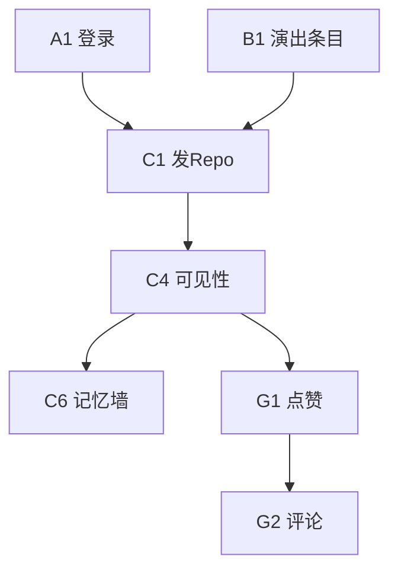

# 产品功能清单（可导入排期）

**用途**：拆 Epic / Story；`depends_on` 为前置功能 ID（逗号分隔）。优先级：`P0` MVP、`P1` 首版后紧接、`P2` 增强、`P3` 远期。

**关联**：[MVP-AND-SOCIAL-DECISIONS.md](./MVP-AND-SOCIAL-DECISIONS.md)（范围默认）、[ARCHITECTURE-PRINCIPLES.md](./ARCHITECTURE-PRINCIPLES.md)（跨 Epic 约束）。

---

## Epic A — 账号与安全

| ID | 功能 | 优先级 | 依赖 |
|----|------|--------|------|
| A1 | 注册登录（手机 / 三方 OAuth） | P0 | — |
| A2 | 账号注销与数据导出（合规预留） | P1 | A1 |
| A3 | 隐私设置：默认记录可见性、黑名单、屏蔽互动 | P0 | A1 |
| A4 | 实名 / KOL 背书入口（与 POA Identity Proof 联动） | P2 | A1, E4 |

---

## Epic B — 演出条目（Wiki）

| ID | 功能 | 优先级 | 依赖 |
|----|------|--------|------|
| B1 | 演出唯一键：艺人 + 日期 + 场馆；创建与展示 | P0 | — |
| B2 | 重复条目检测与合并（运营 / 规则辅助） | P1 | B1 |
| B3 | 条目详情：基础信息、三维度均分、想看/看过人数 | P0 | B1 |
| B4 | 封面：条目下 UGC 点赞最高图；禁止官方海报抓取 | P1 | B1, C5 |
| B5 | 用户自拍海报/票根作为附件 | P1 | B1, C1 |
| B6 | 演出提醒：关注乐队新演出推送 | P2 | A1, B1, H2 |

---

## Epic C — 现场记录（Repo）

| ID | 功能 | 优先级 | 依赖 |
|----|------|--------|------|
| C1 | 图文视频发布、绑定演出条目 | P0 | A1, B1 |
| C2 | 三维 Vibe（1–5） | P0 | C1 |
| C3 | 一句话记忆（必填，≤20 字） | P0 | C1 |
| C4 | 可见性：默认私密；公开到条目 | P0 | C1, A3 |
| C5 | 条目下 Repo 列表：热门（高赞）/ 最新排序 | P0 | C4, B1 |
| C6 | 记忆墙：条目下横向标签流；点击筛同标签 | P0 | C3, C4, B1 |
| C7 | AI：关键词扩写 Repo | P2 | C1 |
| C8 | AI：长文摘要建议一句话记忆 | P2 | C3, C1 |

---

## Epic D — 个人记忆（资产库）

| ID | 功能 | 优先级 | 依赖 |
|----|------|--------|------|
| D1 | 个人时间线（按时间） | P0 | C1 |
| D2 | 地图视图（简版：按场馆聚合） | P1 | C1, B1 |
| D3 | 原始素材云存储与配额策略 | P0 | C1 |
| D4 | 我的记录：编辑、删除、批量改可见性 | P0 | C1, C4 |

---

## Epic E — POA 与票根（MVP 不做，V1.5+）

| ID | 功能 | 优先级 | 依赖 |
|----|------|--------|------|
| E1 | Live Fragment：非阻断 EXIF 检测；匹配则电子票根 | P2 | C1, B1 |
| E2 | EXIF 不匹配：仍发布，无票根或「未验证」标识 | P2 | E1 |
| E3 | 票根 / 卡片系统分享（系统分享面板 / 存图） | P2 | E1 |
| E4 | Identity Proof：认证用户「官方见证」标识 | P2 | A4, C1 |
| E5 | Memory Archaeology：老记录凭证上传、审核、复古卡 | P2 | C1, 审核队列 |
| E6 | 勋章体系与展示位（个人页 / Repo） | P3 | E1, E5 |

---

## Epic F — 共同记忆与发现

| ID | 功能 | 优先级 | 依赖 |
|----|------|--------|------|
| F1 | 同场用户列表（弱曝光，可配置） | P1 | C4, B1 |
| F2 | 审美重合度展示（标签 + Vibe 特征） | P2 | C2, H1 |
| F3 | 发现页：推荐演出 / 条目 / 同好 | P1 | B1, C1 |

---

## Epic G — 互动与深度社交

| ID | 功能 | 优先级 | 依赖 |
|----|------|--------|------|
| G1 | 点赞（Repo） | P0 | C4 |
| G2 | 条目下评论 | P0 | C4, G1 |
| G3 | 举报、审核通知、申诉 | P1 | G2 |
| G4 | 半熟私聊（互关后发消息等） | P2 | A1, G3 |
| G5 | 同场小群 / 组队想看 | P3 | G4, B6 |

---

## Epic H — 集成与数据

| ID | 功能 | 优先级 | 依赖 |
|----|------|--------|------|
| H1 | 网易云音乐偏好同步与刷新 | P2 | A1 |
| H2 | 秀动/大麦等演出元数据拉取与对齐（只读） | P1 | B1 |
| H3 | 搜索：演出、乐队、场地 | P0 | B1 |

---

## Epic I — 商业化预留（产品占位）

| ID | 功能 | 优先级 | 依赖 |
|----|------|--------|------|
| I1 | 会员：云盘配额、票根样式、导出 | P3 | D3, E3 |
| I2 | B 端：匿名 Vibe 聚合报告 / 仪表盘 | P3 | C2, 报表管道 |
| I3 | 品牌合作勋章/皮肤（与 POA 视觉区分） | P3 | E6 |

---

## Epic J — 客户端与多端

| ID | 功能 | 优先级 | 依赖 |
|----|------|--------|------|
| J1 | iOS 原生客户端壳与核心流程 | P0 | API |
| J2 | Android 同上 | P0 | API |
| J3 | 小程序：浏览、想看、轻记录、回流 | P2 | API |
| J4 | 运营后台：条目合并、审核队列、风控配置 | P2 | B2, E5 |

---

## 依赖摘要（跨 Epic）

---

## MVP 范围速查

- **P0 含**：演出条目、Repo、记忆墙、点赞、评论、个人时间线、搜索、双端壳等。
- **P0 不含**：Epic E（POA）、私聊（G4）、小群（G5）。
- 决策依据见 [MVP-AND-SOCIAL-DECISIONS.md](./MVP-AND-SOCIAL-DECISIONS.md)。

---

## 机器可读表（导入 Jira/Notion/表格）

- [feature-backlog.csv](./feature-backlog.csv)：`epic`, `id`, `title`, `priority`, `depends_on`
- [feature-backlog-jira.csv](./feature-backlog-jira.csv)：含 `summary` 列，便于 Jira 一次导入
- 操作步骤见 [BACKLOG-IMPORT.md](./BACKLOG-IMPORT.md)
