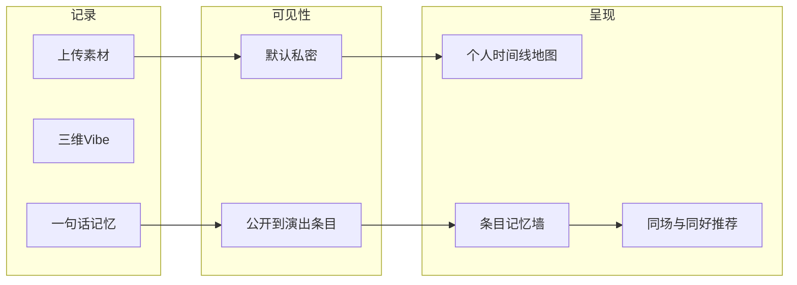

# 平台策略与个人记忆 / 共同记忆

与 [Product-Spec.md](../Product-Spec.md) 的关系：后者描述产品愿景与功能；本文档固定**端策略**与**两条记忆路径**的叙事与路径，供设计与研发对齐。

## 1. 目标平台与过渡策略

- **主目标**：原生 **iOS / Android**（相册与相机 EXIF、推送、分享面板、离线缓存、媒体体验）。
- **小程序过渡（可选）**：适合冷启动与轻路径——查演出、标记想看、短记录、分享回流 App；需接受能力裁剪（后台推送弱、大文件与复杂 IM 体验弱于原生）。
- **实施原则**：业务与领域模型在**独立后端 + 统一 API**；各端只做适配（登录、上传、推送、支付 SDK）。避免把核心规则写死在某一端。

## 2. 个人记忆（Private-first）

| 要素 | 要点 |
|------|------|
| 痛点 | 怕隐私外泄、怕泛社交审判、怕素材散落在系统相册不可检索。 |
| 产品一句话 | 「时间轴与地图上的现场资产库，默认只给自己看。」 |
| 功能路径 | 上传素材 → 绑定「艺人 + 日期 + 场馆」条目 → **默认私密** → 可选「仅共同在场者可见」「公开到条目记忆墙」→ 个人中心按时间线 / 地图 / 乐队检索。 |
| 与 POA | 票根 / 验证是**自我背书与分享素材**，不强制等于全网公开。 |

## 3. 共同记忆（Co-presence）

| 要素 | 要点 |
|------|------|
| 痛点 | 同场人多，泛平台难以高效遇到「同一场、同一感受」的人。 |
| 产品一句话 | 「同一演出条目下，一句话记忆把现场收成可点击的共鸣索引。」 |
| 功能路径 | 用户选择公开到该条目 → 一句话记忆进入**记忆墙** → 点击标签进入**同标签 Repo 列表** → 点赞 / 评论；系统可弱推荐「同场 + 审美重合」用户（不强推私聊）。 |
| 与 POA | MVP 不做 POA；列表按 **高赞 / 最新** 排序。POA 上线后可再加「已验证」加权（见 Epic E）。 |

## 4. 统一资产模型

两条线共用同一内容单元：**单场演出下的 Repo**。差异仅来自**可见性**与**在条目下的曝光策略**，避免「两套产品两套后台」。

