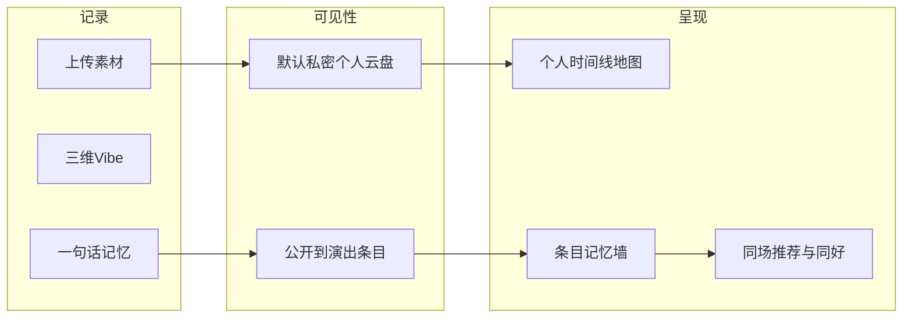

# 底噪：平台策略、记忆路径、架构原则与功能清单

## 1. 目标平台与过渡策略

- **主目标**：原生 iOS / Android（体验、相册/相机 EXIF、推送、离线、分享卡片深度集成）。
- **小程序过渡**（可选）：适合冷启动获客与轻量「查演出 + 标记想看 + 简单记录」；需接受能力裁剪（文件/相册权限、后台推送、复杂媒体处理、深度社交 IM 体验弱于原生）。
- **与原文档差异**：原 [Product-Spec.md](h:\DevTools\WNMP\www\background-noise\Product-Spec.md) 写 Web PWA；实施上以 **移动端 API + 多端客户端** 为准，避免把业务逻辑绑死在某一端。

**架构含义**：核心业务与数据模型放在 **独立后端 + 统一领域模型**；客户端按端做适配层（上传、推送、支付、分享 SDK）。

---

## 2. 个人记忆 vs 共同记忆：精炼且戳痛点的产品路径

两条线共用同一资产：**「单场演出 Repo」**，差别在于 **默认可见范围、聚合方式、触发社交的时机**。

### 2.1 个人记忆（Private-first Memory）

| 要素 | 设计要点 |
|------|----------|
| **痛点** | 怕隐私外泄、怕泛社交审判、怕碎片散落相册找不到。 |
| **一句话** | 「这是我的时间轴与地图上的现场资产库，默认只给自己看。」 |
| **功能路径** | 上传原始素材 → 自动归入「艺人+日期+场馆」条目 → **默认私密** → 可选「仅共同在场者可见」「公开到条目墙」→ 个人中心按时间线/地图/乐队检索。 |
| **信任感** | POA（EXIF/凭证）用于 **给自己加「我确实现场」的勋章与票根**，不强制等于「全网公开」。 |

**戳点**：私密默认 + 结构化归档，解决「敢记」和「找得到」。

### 2.2 共同记忆（Co-presence Memory）

| 要素 | 设计要点 |
|------|----------|
| **痛点** | 同场的人很多，但泛平台刷不到「同一场同一瞬间」的共鸣。 |
| **一句话** | 「同一演出条目下，用一句话记忆把千人现场收成可点击的共鸣索引。」 |
| **功能路径** | 用户选择 **公开到该演出条目** → 「一句话记忆」进入 **记忆墙（标签云/横向流）** → 点击标签进入 **同标签 Repo 聚合页** → 点赞/评论；系统可推荐 **同场且审美重合度高** 的用户（不强推私聊）。 |
| **与 POA 关系** | 共同记忆里 **排序/曝光** 偏向「已验证 + 高赞」，未验证仍可参与共鸣，但权重较低，平衡包容与信噪比。 |

**戳点**：条目级聚合 + 短句索引，解决「同场不同框」的发现成本。

### 2.3 二者如何自然衔接（避免两套产品）

---

## 3. 系统架构建设：拓展性与鲁棒性（面向未知功能）

不绑定具体框架选型细节，坚持以下 **边界与原则**，便于后续商业化、深度社交、多端扩展。

### 3.1 分层与边界

- **领域层**：演出条目、Repo、用户、可见性、POA 状态、评分维度、标签、关系（关注/同场）、推荐特征——**与 HTTP/推送/支付无关**。
- **应用服务层**：用例编排（发布记录、变更可见性、审核流、推荐任务）。
- **适配层**：REST/GraphQL、Webhook、移动端推送、第三方登录、票务元数据同步、网易云 API、未来 IM/支付。
- **读写与增长**：核心路径同步写；**搜索、推荐、报表、审计日志** 可走异步管道（消息队列 + 消费者），避免主链路膨胀。

### 3.2 多租户式「能力插件」预留

- **商业化**：权益（会员、报告导出、B 端席位）建模为 **订阅/权益包 + 策略引擎**，不硬编码在发布接口里。
- **深度社交**：会话、关系链、举报、屏蔽、未成年人策略等 **独立限界上下文**，与「演出内容」通过用户 ID / 条目 ID 关联，避免巨石模块。
- **审核与合规**：POA 考古、UGC 封面、举报统一走 **审核任务 + 状态机**，便于加人工队列与规则版本。

### 3.3 数据与版本

- **事件 + 快照**：关键业务（可见性变更、验证结果）保留审计事件，便于纠纷与推荐重算。
- **API 版本化**：对外契约 semver 或 `/v1`，避免小程序/双端与后端互相拖死。
- **配置驱动**：排序权重、推荐开关、实验桶走配置中心，支持灰度。

### 3.4 鲁棒性

- **幂等**：上传完成回调、支付回调、审核回调全部幂等键。
- **降级**：推荐/AI 失败时主路径仍可发记录；AI 为可选增强。
- **配额与风控**：存储、频率、敏感词、反爬在网关或服务层统一策略。

---

## 4. 产品功能清单（分层，可排期）

以下为 **清单级** 功能，便于你拆 Epic/Story；顺序大致对应 MVP → 扩展。

### A. 账号与安全

- 注册登录（手机/三方）、账号注销与导出（合规预留）
- 隐私设置：默认记录可见性、黑名单、屏蔽互动
- 实名/KOL 背书入口（与 POA 标识联动，可分期）

### B. 演出条目（Wiki）

- 演出唯一键：艺人 + 日期 + 场馆；合并重复条目（运营/算法辅助）
- 条目详情：基础信息、统计（平均分三维度、想看/看过人数）
- 封面规则：条目下 UGC 点赞最高图为主封面；禁止官方海报抓取，用户可上传自拍海报/票为附件
- 演出提醒：关注乐队新演出通知（依赖元数据与推送）

### C. 现场记录（Repo）

- 图文视频发布、三维 Vibe（1–5）
- **一句话记忆**（必填、≤20 字），记忆墙展示与点击筛选
- 排序：热门/最新；加权「已验证 + 高赞」
- AI：关键词扩写、长文摘要建议短句（失败可跳过）

### D. 个人记忆（资产库）

- 个人时间线、地图视图（分期可做简版）
- 原始素材云存储、容量与清理策略（产品规则 + 技术配额）
- 「我的记录」管理：编辑、删改、可见性批量调整

### E. POA 与票根

- Live Fragment：EXIF 时间/地点匹配 → 电子票根卡片
- Memory Archaeology：老记录凭证上传 → 审核 → 复古记忆卡 + 勋章
- Identity Proof：认证用户「官方见证」标识
- 票根/记忆卡一键分享（系统分享面板 / 保存图片）

### F. 共同记忆与发现

- 条目记忆墙、同标签聚合页
- 同场用户列表（弱曝光）、审美重合度展示（基于网易云标签 + Vibe）
- 发现页：推荐演出、推荐条目、推荐同好（可配置强度）

### G. 互动与深度社交（分期）

- 点赞、评论、@（若需要）
- 私聊/半熟关系（申请关注、互关后发消息等，具体模式待你定）
- 群组：同场小群 / 组队看演出（与原文「想看列表组队」衔接）
- 举报、审核结果通知、申诉

### H. 集成与数据

- 网易云音乐偏好同步、授权与刷新
- 秀动/大麦等：演出元数据拉取与对齐（初期只读）
- 搜索：演出、乐队、场地

### I. 商业化预留（文档外延伸，架构先占位）

- 会员：更高云盘、高级票根样式、数据导出
- B 端：匿名聚合 Vibe 报告、场馆/主办仪表盘（权限与计费独立模块）
- 品牌合作：限定勋章/皮肤（勿与 POA 信任混淆，需 UI 区分）

### J. 客户端与多端

- iOS / Android 原生壳 + 业务模块
- （可选）小程序：演出浏览、想看、轻记录、分享回流 App
- 运营后台：条目合并、审核队列、风控配置（可后期）

---

## 5. 建议的下一步（与你对齐）

- 锁定 **MVP 范围**：个人默认私密 + 条目公开可选 + 记忆墙 + 基础互动，是否首版就上 POA 全自动校验。
- 锁定 **深度社交首形态**：仅评论 / 互关私聊 / 小群，三选一或组合优先级。
- 将本节功能清单导入你使用的需求工具（Notion/Jira），按 A–J 标 Epic 与依赖关系。
